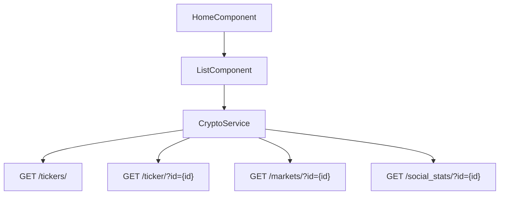
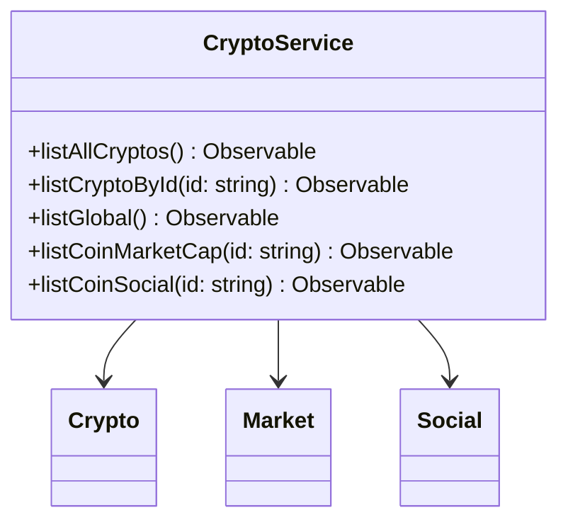

# 📊 Crypto Track Project Documentation

Welcome to the **Crypto Track** project! This documentation provides an in-depth overview of the architecture, components, data flow, and major code files. Whether you're a developer, recruiter, or just curious about how this crypto-tracking Angular application works, this guide will help you understand the system from top to bottom.

---

## 📖 Index

1. [Project Overview](#project-overview)
2. [Application Architecture](#application-architecture)
3. [Core Modules & Configuration](#core-modules--configuration)
    - [app.config.ts](#appconfigts)
    - [app.routes.ts](#approutests)
    - [generate-url.ts](#generate-urlts)
4. [Root Component](#root-component)
    - [app.component.ts](#appcomponentts)
    - [app.component.spec.ts](#appcomponentspects)
5. [Feature Modules & Components](#feature-modules--components)
    - [Home Feature](#home-feature)
        - [home.component.ts](#homecomponentts)
        - [home.component.html](#homecomponenthtml)
        - [home.component.spec.ts](#homecomponentspects)
    - [List Component](#list-component)
        - [list.component.ts](#listcomponentts)
        - [list.component.html](#listcomponenthtml)
        - [list.component.spec.ts](#listcomponentspects)
        - [list.component.scss](#listcomponentscss)
6. [Services & Data Layer](#services--data-layer)
    - [crypto.service.ts](#cryptoservicets)
    - [crypto.service.spec.ts](#cryptoservicespects)
7. [Data Models](#data-models)
    - [crypto.ts](#cryptots)
    - [market.ts](#marketts)
    - [social.ts](#socialts)
8. [API Endpoints](#api-endpoints)
9. [Diagrams](#diagrams)
    - [Service Interaction](#service-interaction)
    - [Class Structure](#class-structure)
10. [Styling](#styling)

---

## Project Overview

**Crypto Track** is an Angular-based, modular, and scalable application for tracking cryptocurrencies. It fetches and displays real-time cryptocurrency data, including prices, market capitalization, and social stats, from external APIs.

---

## Application Architecture

- **Angular Standalone Components**: Modern, modular approach.
- **Service Layer**: Handles API communication and data transformation.
- **Reactive Streams**: Uses RxJS for observable-based data flow.
- **Material UI**: Leverages Angular Material for rich UI components.
- **Testing**: Comprehensive unit tests using Angular's testing utilities.
- **Strict Typing**: Strong TypeScript interfaces for data contracts.

---

## Core Modules & Configuration

### app.config.ts

Configures global application providers and bootstraps key Angular features.

```typescript
export const appConfig: ApplicationConfig = {
  providers: [
    provideZoneChangeDetection({ eventCoalescing: true }),
    provideRouter(routes),
    provideHttpClient(
      withFetch()
    )
  ]
};
```

- **Router**: Registers routes from `app.routes.ts`.
- **HTTP Client**: Enables HTTP requests using the Fetch API.
- **Zone Change Detection**: Optimizes event coalescing for performance.

---

### app.routes.ts

Defines the main application route. Uses Angular's code-splitting for lazy loading.

```typescript
export const routes: Routes = [
  {
    path: '',
    loadComponent: () => import('./feature/home/home.component').then((m) => m.HomeComponent)
  }
];
```

- **Root Route**: Loads `HomeComponent` when at `/`.

---

### generate-url.ts

Generates API endpoint URLs, applying a CORS proxy and base URL.

```typescript
export const generateUrl = (subUrl: string) => {
  const url = `${environment.CORS_PROXY}${encodeURIComponent(environment.COINLORE_BASE_URL + subUrl)}`;
  return url;
};
```

- **Purpose**: Centralizes endpoint generation & CORS handling.

---

## Root Component

### app.component.ts

The single root component bootstrapping the router outlet.

```typescript
@Component({
  selector: 'app-root',
  imports: [RouterOutlet],
  template: `<router-outlet />`,
  standalone: true
})
export class AppComponent {
  title = 'crypto-track';
}
```

- **RouterOutlet**: Enables navigation throughout the app.

---

### app.component.spec.ts

Unit test for the root component.

```typescript
describe('AppComponent', () => {
  // ...setup omitted...
  it('should create the app', () => {
    const fixture = TestBed.createComponent(AppComponent);
    const app = fixture.componentInstance;
    expect(app).toBeTruthy();
  });
});
```

- **Purpose**: Ensures the root component is constructed without errors.

---

## Feature Modules & Components

### Home Feature

#### home.component.ts

The main feature container for the home page.

```typescript
@Component({
  selector: 'crypto-home',
  imports: [CommonModule, ListComponent],
  templateUrl: './home.component.html',
  styleUrl: './home.component.scss',
  standalone: true
})
export class HomeComponent { }
```

- **Composition**: Hosts the `ListComponent`.

#### home.component.html

```html
<p>home works2!</p>
<crypto-track-list></crypto-track-list>
```

- **Display**: Shows a welcome message and a list of cryptocurrencies.

#### home.component.spec.ts

Unit test for HomeComponent.

```typescript
it('should create', () => {
  expect(component).toBeTruthy();
});
```

---

### List Component

#### list.component.ts

Displays a reactive list of cryptocurrencies.

```typescript
@Component({
  selector: 'crypto-track-list',
  standalone: true,
  imports: [CommonModule, MatListModule, MatIconModule],
  templateUrl: './list.component.html',
  styleUrl: './list.component.scss',
})
export class ListComponent implements OnInit {
  cryptos$ = of<Crypto[]>([]);
  constructor(private cryptoService: CryptoService) { }
  ngOnInit(): void {
    this.cryptos$ = this.cryptoService.listAllCryptos();
  }
}
```

- **Data Source**: Uses `CryptoService` to get crypto data as an observable.
- **UI**: Leverages Angular Material List and Icons.

#### list.component.html

```html
<mat-list>
  @for (crypto of cryptos$ | async; track crypto) {
    <mat-list-item>
      <mat-icon matListItemIcon>folder</mat-icon>
      <h3 matListItemTitle>{{crypto.name}}</h3>
      <p matListItemLine>
        <span>{{crypto.symbol}}</span>
        <span class="demo-2"> -- {{crypto.market_cap_usd}}</span>
      </p>
    </mat-list-item>
  }
</mat-list>
```

- **Display**: Shows crypto name, symbol, and market cap.
- **Reactive**: Uses Angular's new `@for` syntax.

#### list.component.spec.ts

Unit test for ListComponent.

```typescript
it('should create', () => {
  expect(component).toBeTruthy();
});
```

#### list.component.scss

*Empty* (custom styles may be added as needed).

---

## Services & Data Layer

### crypto.service.ts

Central service handling all cryptocurrency-related API requests.

```typescript
@Injectable({ providedIn: 'root' })
export class CryptoService {
  constructor(private http: HttpClient) { }

  listAllCryptos(): Observable<Crypto[]> {
    return this.http.get<CryptoResponse>(generateUrl('/tickers/'))
      .pipe(
        tap(response => console.log('✅ Resposta recebida:', response)),
        map(response => response.data),
      );
  }

  listCryptoById(id: string): Observable<CryptoResponse> {
    return this.http.get<CryptoResponse>(generateUrl(`/ticker/?id=${id}`));
  }

  listGlobal(): Observable<GlobalStats> {
    return this.http.get<GlobalStats[]>(generateUrl('/global')).pipe(map(res => res[0]));
  }

  listCoinMarketCap(id: string): Observable<Market[]> {
    return this.http.get<Market[]>(generateUrl(`/markets/?id=${id}`));
  }

  listCoinSocial(id: string): Observable<Social> {
    return this.http.get<Social>(generateUrl(`/social_stats/?id=${id}`));
  }
}
```

#### Methods

| Method               | Description                                                      | Returns                |
|----------------------|------------------------------------------------------------------|------------------------|
| listAllCryptos       | Get all cryptocurrencies                                         | Observable<Crypto[]>   |
| listCryptoById(id)   | Get details for a single crypto by ID                            | Observable<CryptoResponse> |
| listGlobal           | Get global market statistics                                     | Observable<GlobalStats>|
| listCoinMarketCap(id)| Get market data for a specific coin                             | Observable<Market[]>   |
| listCoinSocial(id)   | Get social stats for a specific coin                            | Observable<Social>     |

---

### crypto.service.spec.ts

Comprehensive unit tests for the `CryptoService`.

- **Tests**:
    - Service instantiation
    - All API methods (success & error scenarios)
    - Uses Angular's HTTP testing utilities

---

## Data Models

### crypto.ts

Defines interfaces for core crypto data.

```typescript
export interface Crypto {
  id: string;
  symbol: string;
  name: string;
  nameid: string;
  rank: number;
  price_usd: string;
  percent_change_24h: string;
  percent_change_1h: string;
  percent_change_7d: string;
  price_btc: string;
  market_cap_usd: string;
  volume_24h: number;
  volume_24a: number;
  csupply: string;
  tsupply: string;
  msupply: string;
}

export interface CryptoResponse {
  data: Crypto[];
  info: {
    coins_num: number;
    time: number;
  }
}

export interface GlobalStats {
  coins_count: number;
  active_markets: number;
  total_volume: number;
  btc_d: string;
  eth_d: string;
  mcap_change: string;
  volume_change: string;
  avg_change_percent: string;
  volume_ath: number;
  mcap_ath: number;
}
```

---

### market.ts

Represents market details for a cryptocurrency.

```typescript
export interface Market {
  name: string;
  base: string;
  quote: string;
  price: number;
  price_usd: number;
  volume: number;
  volume_usd: number;
  time: number;
}
```

---

### social.ts

Represents social statistics for a cryptocurrency.

```typescript
export interface Social {
  reddit: Reddit;
  twitter: Twitter;
}

export interface Reddit {
  avg_active_users: number;
  subscribers: number;
}

export interface Twitter {
  status_count: number;
  followers_count: number;
}
```

---

## API Endpoints

### Crypto List

```api
{
  "title": "List All Cryptocurrencies",
  "description": "Fetch a list of all cryptocurrencies with basic info.",
  "method": "GET",
  "baseUrl": "https://api.coinlore.net",
  "endpoint": "/api/tickers/",
  "headers": [],
  "queryParams": [],
  "pathParams": [],
  "bodyType": "none",
  "requestBody": "",
  "responses": {
    "200": {
      "description": "Success",
      "body": "{\n  \"data\": [...],\n  \"info\": { \"coins_num\": 123, \"time\": 12345678 } \n}"
    }
  }
}
```

### Crypto Detail

```api
{
  "title": "Get Crypto by ID",
  "description": "Fetch details for a single cryptocurrency.",
  "method": "GET",
  "baseUrl": "https://api.coinlore.net",
  "endpoint": "/api/ticker/?id={id}",
  "headers": [],
  "queryParams": [],
  "pathParams": [
    {
      "key": "id",
      "value": "Crypto ID",
      "required": true
    }
  ],
  "bodyType": "none",
  "requestBody": "",
  "responses": {
    "200": {
      "description": "Success",
      "body": "{\n  \"data\": [...],\n  \"info\": { \"coins_num\": 1, \"time\": 12345678 } \n}"
    }
  }
}
```

### Market Data

```api
{
  "title": "Get Coin Market Data",
  "description": "Fetch market information for a specific cryptocurrency.",
  "method": "GET",
  "baseUrl": "https://api.coinlore.net",
  "endpoint": "/api/markets/?id={id}",
  "headers": [],
  "queryParams": [],
  "pathParams": [
    {
      "key": "id",
      "value": "Crypto ID",
      "required": true
    }
  ],
  "bodyType": "none",
  "requestBody": "",
  "responses": {
    "200": {
      "description": "Success",
      "body": "[ { \"name\": \"Binance\", \"base\": \"BTC\", \"quote\": \"USDT\", ... } ]"
    }
  }
}
```

### Social Stats

```api
{
  "title": "Get Coin Social Stats",
  "description": "Fetch social media statistics for a specific coin.",
  "method": "GET",
  "baseUrl": "https://api.coinlore.net",
  "endpoint": "/api/social_stats/?id={id}",
  "headers": [],
  "queryParams": [],
  "pathParams": [
    {
      "key": "id",
      "value": "Crypto ID",
      "required": true
    }
  ],
  "bodyType": "none",
  "requestBody": "",
  "responses": {
    "200": {
      "description": "Success",
      "body": "{ \"reddit\": { ... }, \"twitter\": { ... } }"
    }
  }
}
```

---

## Diagrams

### Service Interaction



**Explanation**:  
- The `HomeComponent` renders the `ListComponent`.
- The `ListComponent` uses `CryptoService` for all data.
- `CryptoService` calls various API endpoints to fetch crypto, market, and social data.

---

### Class Structure



---

## Styling

### list.component.scss & home.component.scss

*Currently empty.*  
You can add custom styles as needed for branding or advanced UI.

---